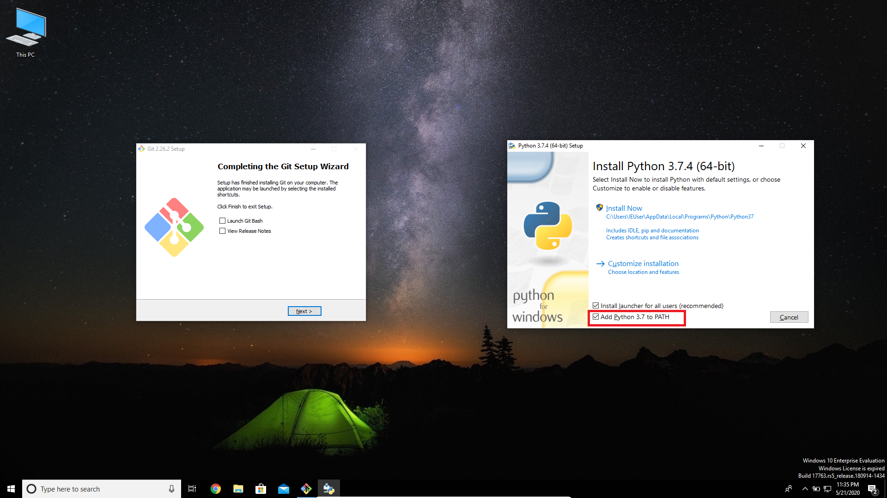

# Web Scraping - Download Multiple Google Images From A Single Command - Using Selenium

The webdriver included here supports Google Chrome Version 83.0.4103.61 and Windows 10. If you want to use it with some other version of Google Chrome, please find the respective chromedriver in the link provided below:

https://sites.google.com/a/chromium.org/chromedriver

## Installation Documentation

Install the latest version of Git and Python from the links given below:

Git: https://git-scm.com/download/win

Python-3.7.4: https://www.python.org/downloads/release/python-374

Be sure to check Add Python to path option while installing python

        git clone https://github.com/ShobhitBansal/Web-Scraping-Download-Multiple-Google-Images-From-A-Single-Command-Using-Selenium.git
    
        cd Web-Scraping-Download-Multiple-Google-Images-From-A-Single-Command-Using-Selenium
    
        pip install -r requirements.txt
    

Each time when you want to download images, come to the current directory and execute the following command:

        scrapy crawl download -a searcword="<keyword>" -a no_of_images"<number>"
    

The images will be downloaded to images/downloads folder

